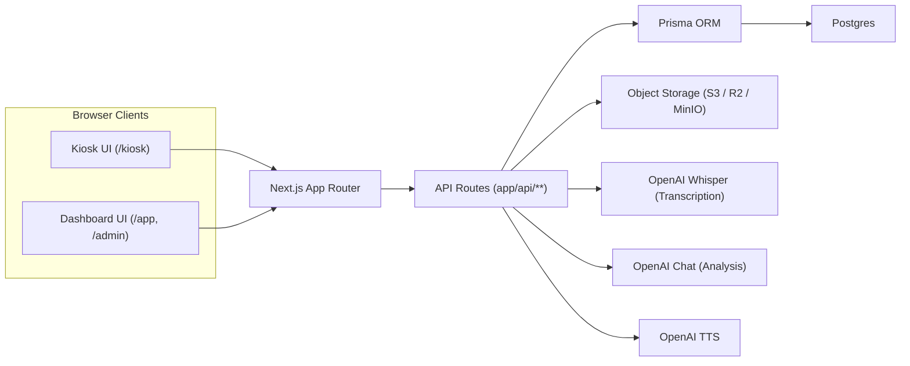

# ARCHITECTURE

Last verified from code: 2026-03-07  
Scope: Next.js app router code in `app/**`, services in `lib/**`, schema in `prisma/schema.prisma`.

## High-Level System Diagram

## System Context

- `Kiosk`: Anonymous voice-capture surface for respondents, including consent, question playback, recording, upload, and completion.
- `Customer App (/app)`: Account-scoped operational surface for locations/events, branding/consent settings, and analytics.
- `Platform Admin (/admin)`: Cross-account provisioning and account management surface intended for super-admin workflows.

## 1) Product Overview

### Confirmed

Booth Audio / Voice Survey is a multi-tenant voice feedback platform with:

- kiosk voice capture (`/kiosk`) for anonymous respondents
- AI transcription + analysis pipeline
- customer account dashboard (`/app`) for survey/event operations and analytics
- platform admin area (`/admin`) for account provisioning/management
- passwordless email auth through Supabase magic links

### Inferred

The main production focus appears to be retail-style kiosk feedback with account/location/event scoping, while older "event dashboard" surfaces are still maintained.

## 2) Main App Surfaces and Routes

## Public / Entry

- `/` -> client redirect to `/login`
- `/login` -> magic-link sign-in UI
- `/auth/callback` -> exchanges auth code for Supabase session, then redirects to `/api/auth/link-user`
- `/start` -> public onboarding/provisioning form (calls `/api/provision/start`)

## Kiosk

- `/kiosk?eventId=<id>` -> consent + question flow + recording UI
- `/kiosk/thank-you` -> generic thank-you screen

Kiosk API routes:

- `/api/response/create`
- `/api/answer/presign`
- `/api/answer/complete`
- `/api/answer/confirm`
- `/api/response/[responseId]/complete`
- `/api/kiosk/event-details`
- `/api/tts`

## Customer App (`/app`)

- `/app` -> account home dashboard
- `/app/events/[eventId]` -> analytics dashboard
- `/app/settings/profile` -> locations + consent + branding settings
- `/app/surveys/create`
- `/app/surveys/[surveyId]/edit`
- `/app/help`

Customer API routes (account-scoped by `?account=<slug>` pattern):

- `/api/app/account`
- `/api/app/account/settings`
- `/api/app/account/logo-upload`
- `/api/app/account/logo-presign`
- `/api/app/logo`
- `/api/app/locations`
- `/api/app/locations/[locationId]`
- `/api/app/events`
- `/api/app/events/[eventId]`
- `/api/app/events/[eventId]/analysis`
- `/api/app/events/[eventId]/signals`
- `/api/app/events/[eventId]/timeline`

## Platform Admin (`/admin`)

- `/admin` -> account list/manage UI
- `/admin/provision` -> retail account provision form
- legacy event review pages under `/admin/events/[eventId]/**`

Platform API routes:

- `/api/admin/accounts`
- `/api/admin/provision-retail`

## Legacy/general event analytics APIs (non-`/api/app`)

- `/api/events/[eventId]/questions`
- `/api/events/[eventId]/responses`
- `/api/events/[eventId]/responses/[responseId]`
- `/api/events/[eventId]/answers`
- `/api/events/[eventId]/analysis`
- `/api/events/[eventId]/analysis/recompute`

## 3) Request/Data Flow

## Kiosk flow (confirmed)

1. Client creates response: `POST /api/response/create`.
2. Server verifies event and returns questions from `Event.questionsJson`.
3. Client records audio (`MediaRecorder`) and requests upload URL: `POST /api/answer/presign`.
4. Client uploads directly to S3-compatible object storage with presigned PUT.
5. Client confirms upload exists: `POST /api/answer/complete`.
6. Client triggers processing: `POST /api/answer/confirm`.
7. `answer/confirm`:

- updates `Answer` status (`UPLOADED` -> `PROCESSING_*` -> `COMPLETED`/`FAILED`)
- transcribes via `lib/transcription.ts` (OpenAI Whisper)
- analyzes via `lib/analysis.ts` (OpenAI chat completion)
- persists `AnswerTranscript`, `AnswerAnalysis`, `AnswerProcessingLog`

1. After all pending uploads complete, client finalizes response: `POST /api/response/[responseId]/complete`.

## Dashboard analytics flow (confirmed)

- App dashboard pages call `/api/app/events/*` endpoints for timeline, aggregate analysis, and signals.
- Signals are computed in `lib/analytics/signals.ts` from `Response` + `AnswerAnalysis` data over a time window.

## Provisioning flow (confirmed)

- `/start` and `/admin/provision` submit to provisioning APIs.
- `lib/provisioning.ts` creates `Account`, `Location`, default `Event`, `PendingProvision`, then sends Supabase OTP link.

## 4) Supabase Responsibilities vs Prisma Responsibilities

### Supabase (confirmed)

- Authentication/session only:
- email OTP/magic link
- callback code exchange
- browser/server session handling
- No application business entities are stored/retrieved via Supabase client APIs in this codebase.

### Prisma/Postgres (confirmed)

- System of record for domain data:
- account/location/event hierarchy
- responses/answers/transcript/analysis/logs
- users/roles + pending provisioning
- account settings/branding/consent JSON

## 5) Auth and Session Model

### Confirmed

- Login: `/login` calls `supabase.auth.signInWithOtp`.
- Callback: `/auth/callback` calls `exchangeCodeForSession`.
- Linking: `/api/auth/link-user` upserts Prisma `User`, resolves account via `PendingProvision`/legacy fallback, then redirects.
- Role model in Prisma `User.role` (`SUPER_ADMIN`, `ADMIN`, `MANAGER`, `VIEWER`).

### Confirmed gap

- Root `middleware.ts` is a no-op and does not enforce auth.
- `lib/supabase/middleware.ts` exists but is not wired into root middleware.

## 6) Tenant/Account Scoping Model

### Confirmed

- Most app APIs use `?account=<slug>` query param.
- API handlers resolve `Account` by slug, then scope queries by relation (`location.accountId = account.id`).

### Inferred risk (supported by code paths)

- Enforcement is inconsistent:
- some `/api/app/*` routes validate Supabase user session
- several `/api/app/*` routes do not check auth at all (`/api/app/account*`, logo routes, app event analysis/signals/timeline)
- user-to-account membership (`User.accountId`) is generally not checked in app APIs
- result: current scoping relies heavily on slug + query filters instead of strict identity-based authorization

## 7) Storage, Transcription, and Analysis Pipeline

### Confirmed

- Upload storage abstraction: `lib/objectStorage.ts` (S3-compatible; MinIO/R2/S3)
- Legacy wrapper: `lib/s3.ts` (still used by transcription path)
- Transcription: `lib/transcription.ts` -> OpenAI Whisper
- Analysis: `lib/analysis.ts` -> OpenAI chat completion (JSON response)
- Processing durability:
- status transitions on `Answer`
- per-step logging in `AnswerProcessingLog`
- idempotent transcript/analysis upserts in confirm endpoint

### Notable behavior

- `POST /api/answer/confirm` performs transcription + analysis inline (synchronous request path), not as background queue workers.

## 8) TTS Flow

### Confirmed

- Client helper `lib/tts.ts` calls `POST /api/tts` with question text.
- `/api/tts`:
- hashes `(voice:text)` into cache key
- checks object existence in storage
- reuses cached mp3 or generates via OpenAI TTS
- returns playable URL (direct local URL or presigned GET)
- Kiosk uses this for autoplay/manual "Hear Question" behavior.

## 9) Important Modules/Services

- `lib/prisma.ts` -> lazy Prisma singleton initialization
- `lib/event.ts` -> event lookup, response create/complete, question fetch
- `lib/analytics/signals.ts` -> deterministic signal computation
- `lib/event-analysis.ts` -> aggregate event analysis helper
- `lib/insights/themes.ts` -> key insight classification/recommendation text logic (+ opt-in dev tests)
- `lib/provisioning.ts` -> account/location/event bootstrap + invite
- `lib/templates/*` -> template/vertical config system for dashboard behavior

## 10) Architectural Inconsistencies / Tech Debt

### Confirmed

- Mixed auth enforcement across APIs (some session-checked, some not).
- Root middleware not enforcing auth/role despite comments in some routes implying middleware protection.
- Coexistence of new models (`Response/Answer/*`) and legacy models (`Session/Transcript/Analysis/ProcessingLog`).
- Legacy and new analytics surfaces both exist (`/api/events/*` and `/api/app/events/*`), with different scoping/security patterns.
- `settingsJson` and `questionsJson` are flexible JSON blobs, which improves speed but weakens schema-level guarantees.
- Some comments are stale (e.g., "getOrCreate" wording, auto-seed comments not matching current behavior).

### Inferred

- The codebase is mid-migration from older single-surface event tooling to a stricter account-scoped SaaS model, but authorization hardening is incomplete.

