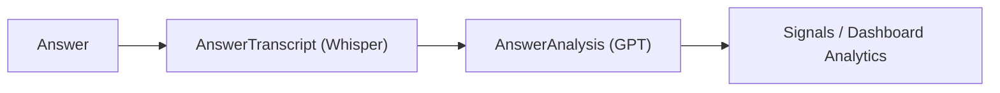

# DB_SCHEMA

Last verified from code: 2026-03-07  
Primary source: `prisma/schema.prisma` + Prisma usage in API/service code.

## 1) Core Data Model (Confirmed)

Primary hierarchy in active flows:
- `Account` -> `Location` -> `Event` -> `Response` -> `Answer`
- `Answer` -> optional `AnswerTranscript`, optional `AnswerAnalysis`, many `AnswerProcessingLog`

This is the pipeline used by kiosk capture, transcription, and analytics APIs.

## Answer Processing Pipeline



## Core Tables Quick Reference

| Table | Role |
| --- | --- |
| `Account` | Tenant |
| `Location` | Physical location |
| `Event` | Survey container |
| `Response` | One kiosk session |
| `Answer` | One recorded answer |
| `AnswerTranscript` | Whisper transcript |
| `AnswerAnalysis` | AI insights |

## 2) Entity Relationship Map

```
Account (1) ──< Location (many)
Location (1) ──< Event (many)
Event (1) ──< Response (many)
Response (1) ──< Answer (many)
Answer (1) ──1 AnswerTranscript (0..1)
Answer (1) ──1 AnswerAnalysis (0..1)
Answer (1) ──< AnswerProcessingLog (many)

Account (1) ──< User (many)
Account (1) ──< PendingProvision (many)
Account (1) ──< Admin (many, legacy)
```

## 3) Core Entities and Structure

## Account
Purpose:
- top-level tenant

Key fields:
- `id`, `name`, `slug` (unique)
- `accountType` (`RETAIL | EVENTS | HOSPITALITY`)
- `tier`, `trialEndsAt`, `isActive`
- `settingsJson` (branding/consent settings currently stored here)

Notes:
- `slug` is heavily used in route query params for scoping (`?account=<slug>`).

## Location
Purpose:
- physical or logical site under an account

Key fields:
- `accountId`, `name`, `slug` (unique per account)
- address fields, `timezone`, `googleReviewUrl`
- `settingsJson`, `isActive`

## Event
Purpose:
- survey/campaign container under a location

Key fields:
- `locationId`, `name`, `description`
- `eventType`, `status`, `isActive`
- `questionsJson` (array of question objects)

Important:
- Question definitions are JSON-based, not normalized table rows.

## Response
Purpose:
- one kiosk respondent session for an event

Key fields:
- `eventId`, `anonymousId`
- `status` (`IN_PROGRESS | COMPLETED | ABANDONED`)
- `startedAt`, `completedAt`, `metadata`

## Answer
Purpose:
- one audio answer for one question in a response

Key fields:
- `responseId`, `questionKey`, `promptLabel`
- audio metadata: `objectKey` (unique), `objectEtag`, `mimeType`, `fileSizeBytes`, `durationMs`
- processing state: `status`, `statusReason`

State enum:
- `CREATED -> UPLOADING -> UPLOADED -> PROCESSING_TRANSCRIPT -> PROCESSING_ANALYSIS -> COMPLETED` (or `FAILED`)

## AnswerTranscript
Purpose:
- transcript output

Key fields:
- `answerId` (unique), `provider`, `model`, `text`, `wordsJson`

## AnswerAnalysis
Purpose:
- AI analysis output

Key fields:
- `answerId` (unique), `provider`, `model`, `promptVersion`
- `summary`, `sentimentScore`, `sentimentLabel`
- `themesJson`, `actionsJson`, `entitiesJson`

## AnswerProcessingLog
Purpose:
- per-step processing audit trail

Key fields:
- `answerId`, `step` (`UPLOAD | TRANSCRIBE | ANALYZE`)
- `attempt`, `startedAt`, `endedAt`
- `errorCode`, `errorMessage`, `metadata`

## 4) User and Role Model

## User (active auth identity model)
- `id` is Supabase user id (uuid string)
- `email` unique
- `role`: `SUPER_ADMIN | ADMIN | MANAGER | VIEWER`
- `accountId` nullable
- nullable `accountId` is used for `SUPER_ADMIN`

## PendingProvision
- maps owner email -> account before first login
- used by `/api/auth/link-user` to attach authenticated user to the provisioned account

## Admin (legacy)
- older admin table retained for compatibility
- still referenced as fallback in `link-user`

## 5) Account/Authorization Rules Inferred from Code

### Confirmed from handlers
- Many app APIs resolve account by slug and then filter Prisma queries by `account.id` relation path.
- Some APIs validate Supabase session (`getUser`), but not all.
- Direct `User.accountId` membership checks are rarely enforced in app routes.

### Inferred effective rule today
- Practical access control is mostly "knowing a valid account slug + endpoint behavior" with partial session checks, rather than full identity-to-tenant enforcement.

## 6) Core vs Legacy/Secondary Tables

## Core (actively used in kiosk + current app analytics)
- `Account`, `Location`, `Event`, `Response`, `Answer`
- `AnswerTranscript`, `AnswerAnalysis`, `AnswerProcessingLog`
- `User`, `PendingProvision`

## Legacy/secondary (still present)
- `Session`, `Transcript`, `Analysis`, `ProcessingLog`
- `Admin`

Observed usage:
- `Session` is still explicitly deleted when deleting an event in one route.
- Current capture/processing path writes to `Response/Answer/*`, not `Session/*`.

## 7) RLS Observations

### Confirmed
- No Row Level Security policies are defined in Prisma migrations in this repo.
- Supabase is used for auth/session, not as RLS-enforced query layer in app code.

### Inferred
- Tenant isolation currently depends on application-layer query filters and route checks, not database-level RLS guarantees.

## 8) Schema Risks / Inconsistencies / Ownership Boundaries

### Confirmed
- Dual model sets (`Response/Answer/*` and legacy `Session/*`) increase migration complexity.
- `settingsJson` and `questionsJson` are untyped JSON, so contracts live in app code, not schema constraints.
- `types/index.ts` still re-exports legacy `Transcript`/`Analysis` names, which can confuse new contributors.
- Auth ownership boundaries are blurry: Supabase identity exists, but many domain API checks do not tie requests back to `User.accountId`.

### Inferred
- `settingsJson` currently mixes branding + consent concerns; if settings grow, ownership and validation boundaries may become harder to maintain.
