# PROCESSING_PIPELINE

Last verified from code: 2026-03-07  
Primary implementation paths: `app/kiosk/page.tsx`, `components/kiosk/AudioRecorder.tsx`, `app/api/answer/*`, `lib/transcription.ts`, `lib/analysis.ts`.

## End-to-End Answer Lifecycle

1. Audio capture:
- Kiosk records one answer in-browser with `MediaRecorder`.

2. Upload:
- Client requests a presigned URL from `POST /api/answer/presign`.
- Client uploads audio directly to object storage (S3-compatible).
- Client calls `POST /api/answer/complete` to verify object existence.

3. Confirm + processing:
- Client calls `POST /api/answer/confirm`.
- API marks answer as uploaded, logs upload step, then processes synchronously.

4. Transcription:
- `lib/transcription.ts` downloads object and sends audio to OpenAI Whisper.
- Transcript persists to `AnswerTranscript` (upsert).

5. Analysis:
- `lib/analysis.ts` sends transcript to OpenAI Chat completion.
- Analysis persists to `AnswerAnalysis` (upsert).

6. Storage and status:
- `Answer` status moves through `UPLOADED -> PROCESSING_TRANSCRIPT -> PROCESSING_ANALYSIS -> COMPLETED` (or `FAILED`).
- Step logs persist to `AnswerProcessingLog`.

7. Analytics usage:
- Dashboard and signals endpoints read `AnswerAnalysis` and related answer/response data for aggregates.

## Pipeline Diagram

```mermaid
flowchart LR
  Capture["Audio Capture (Kiosk)"] --> Presign["POST /api/answer/presign"]
  Presign --> Upload["Direct Upload to Object Storage"]
  Upload --> Complete["POST /api/answer/complete"]
  Complete --> Confirm["POST /api/answer/confirm"]
  Confirm --> Transcribe["Whisper Transcription"]
  Transcribe --> Analyze["GPT Analysis"]
  Analyze --> Persist["Persist AnswerTranscript + AnswerAnalysis + Logs"]
  Persist --> Use["Dashboard Analytics / Signals"]
```

